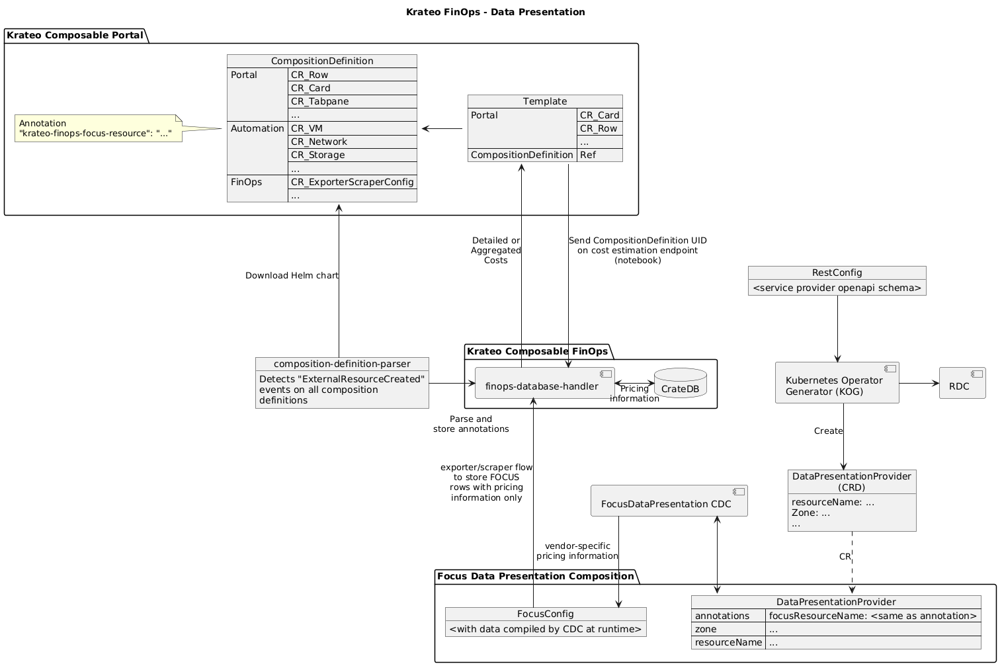

# Azure Pricing Rest Dynamic Controller Plugin
This module is part of the FinOps Data Presentation component, in the Krateo Composable FinOps.

## Summary

1. [Overview](#overview)
2. [Architecture](#architecture)
3. [Examples](#examples)
4. [Configuration](#configuration)

## Overview
This module is an API-Wrapper for the [rest-dynamic-controller](https://github.com/krateoplatformops/rest-dynamic-controller) that allows the utilization of the [Kubernetes Operator Generator](https://github.com/krateoplatformops/oasgen-provider/) to collect information from a REST API. In this instance, we are collecting pricing data from the Azure API, however, the Azure pricing API returns a nested object, which is difficult to manage automatically. This simple plugin unwraps the nested object and then returns it, without any other modification.

## Architecture
In the diagram, this component is the `DataPresentationProvider` (in this specific instance, the provider is Azure).



## Examples
Since the Azure pricing API only requires the filter parameter, the generated custom resource only needs to have the filter value compiled:
```yaml
apiVersion: finops.krateo.io/v1alpha1
kind: DataPresentationAzure
metadata:
  name: sample
spec:
  $filter: serviceFamily eq 'Compute' and armRegionName eq 'westeurope' and skuId eq 'DZH318Z08NRP/001B' and type eq 'Consumption'
```

## Configuration
It is highly recommended to use this module with the [focus-data-presentation-azure](https://github.com/krateoplatformops/focus-data-presentation-azure) composition, which allows the automatic creation of the FocusConfig from the [finops-operator-focus](https://github.com/krateoplatformops/finops-operator-focus), which also starts the exporting/scraping process, automatically storing data into the database. See [finops-operator-exporter](https://github.com/krateoplatformops/finops-operator-exporter) and [finops-operator-scraper](https://github.com/krateoplatformops/finops-operator-scraper) for more information.